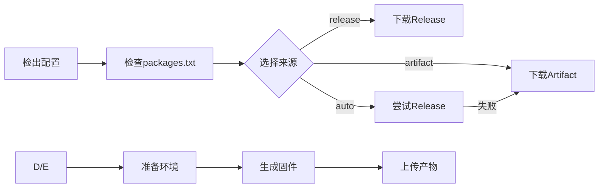

# iStoreOS 自动编译工作流

[](https://github.com/features/actions)
[](https://openwrt.org)
[](https://github.com/Firsgith/istoreos)

## 📋 项目简介

本项目提供了一套完整的 iStoreOS 自动编译工作流，包含**季度完整编译**和**日常快速定制**两个核心功能。通过 GitHub Actions 实现自动化编译，支持自定义配置和软件包选择。

### ✨ 主要特性

- 🤖 **全自动编译** - 每季度自动触发，也可手动启动
- 🚀 **快速定制** - 基于 Image Builder 15-30 分钟生成固件
- 💾 **智能缓存** - 工具链缓存，二次编译仅需 40-60 分钟
- 📦 **双源选择** - 支持 Release 和 Artifact 两种 Image Builder 来源
- 🔧 **灵活配置** - 通过 `.config` 和 `packages.txt` 自由定制
- 📝 **自动发布** - 编译成功自动创建 Release 并上传固件

## 🚀 快速开始

### 前置准备

1. **Fork 本仓库** 到你的 GitHub 账号
2. **准备配置文件**（二选一或都准备）：
   - `.config` - OpenWrt 完整配置（用于季度编译）
   - `packages.txt` - 软件包列表（用于快速定制）

### 📁 配置文件示例

#### `.config`（季度编译用）
```bash
# 目标平台
CONFIG_TARGET_rockchip=y
CONFIG_TARGET_rockchip_armv8=y
CONFIG_TARGET_rockchip_armv8_DEVICE_lyt_t68m=y

# 核心组件
CONFIG_PACKAGE_luci=y
CONFIG_PACKAGE_luci-ssl=y
CONFIG_PACKAGE_dockerd=y
CONFIG_PACKAGE_docker-compose=y

# 网络工具
CONFIG_PACKAGE_iperf3=y
CONFIG_PACKAGE_curl=y
CONFIG_PACKAGE_wget-ssl=y
```

#### `packages.txt`（快速定制用）
```bash
# 系统基础
luci
luci-compat
luci-lib-ipkg

# 网络应用
luci-app-firewall
luci-app-dockerman
docker
docker-compose

# 工具
curl
wget-ssl
htop
iperf3

# 要移除的包（前面加 -）
-dnsmasq
+dnsmasq-full
```

## 🔄 工作流说明

### 1. 季度完整编译 (`build-full.yml`)

**触发方式**：
- 每季度自动运行（1/4/7/10 月 1 号）
- 手动触发（Actions → iStoreOS 完整编译 → Run workflow）

**执行流程**：


**产物**：
- 📦 固件文件 (`*.img.gz`)
- 🔧 Image Builder (`imagebuilder-*.tar.xz`)
- ⚙️ 配置信息 (`config.buildinfo`)
- 📝 更新日志 (`update_log.md`)

### 2. 快速定制 (`quick-build.yml`)

**触发方式**：手动触发（Actions → Image Builder 快速生成 → Run workflow）

**输入参数**：

| 参数 | 说明 | 示例 |
|------|------|------|
| `source` | Image Builder 来源 | `release` / `artifact` / `auto` |
| `version_tag` | 指定版本标签（留空用最新） | `istoreos-24.10-123` |
| `extra_packages` | 额外添加的包 | `luci-app-netdata docker-compose` |
| `remove_packages` | 要移除的包 | `luci-app-upnp -dnsmasq` |

**来源说明**：

| 来源 | 说明 | 有效期 |
|------|------|--------|
| `release` | 从 Release 下载（推荐） | 永久 |
| `artifact` | 从 Artifact 下载 | 30天 |
| `auto` | 自动：Release优先，失败回退到 Artifact | - |

**执行流程**：


**产物**：
- 📦 定制固件 (`*.img.gz`)
- ✅ 校验和 (`firmware.sha256`)
- ⚙️ 配置信息 (`config.md`)

## 🎯 使用场景示例

### 场景1：首次设置
```bash
# 1. Fork 仓库
# 2. 创建 .config 文件
# 3. 创建 packages.txt 文件
# 4. 手动触发完整编译
```

### 场景2：季度更新后快速定制
```bash
# 1. 等待季度自动编译完成
# 2. 触发快速定制工作流
# 3. 选择 source = "release"
# 4. 添加需要的包（如 docker-compose）
# 5. 15分钟后获得新固件
```

### 场景3：调试特定包
```bash
# 1. 触发快速定制
# 2. 选择 source = "auto"
# 3. extra_packages = "你的测试包"
# 4. 如果失败，查看调试日志
# 5. 调整后重试
```

## ⚙️ 高级配置

### 自定义设备型号

修改工作流文件中的 `PROFILE` 变量：

```yaml
# quick-build.yml
env:
  PROFILE: 你的设备型号  # 如：lyt_t68m, x86_64, r4s等
```

### 修改源码仓库

```yaml
# build-full.yml
env:
  REPO_URL: 你的源码仓库地址
  REPO_BRANCH: 你的分支
```

### 调整缓存策略

```yaml
- name: 缓存Toolchain
  uses: actions/cache@v4
  with:
    key: 你的自定义缓存键
```

## 📊 时间预估

| 场景 | 无缓存 | 有缓存 | 说明 |
|------|--------|--------|------|
| 完整编译 | 3-4小时 | 40-60分钟 | 季度任务 |
| 快速定制 | 15-30分钟 | 15-30分钟 | 按需触发 |

## 🔧 故障排查

### 常见问题

#### Q: 编译失败，提示找不到包
**A**: 检查 `packages.txt` 中的包名是否正确，或尝试移除该包。

#### Q: 快速定制时提示 "未找到 Image Builder"
**A**: 
- 如果是 `release` 源：先运行一次完整编译
- 如果是 `artifact` 源：确保 30 天内有成功编译

#### Q: 磁盘空间不足
**A**: 工作流已自动清理系统空间，如仍有问题可手动触发完整编译。

### 查看日志

1. 进入 Actions 页面
2. 点击失败的运行
3. 下载调试信息 Artifact
4. 查看 `config.log` 等日志文件

## 📝 更新日志

### v2.0 (2024)
- ✨ 新增 Image Builder 快速定制工作流
- 🚀 优化缓存策略，二次编译提速
- 🔧 支持 Release/Artifact 双源选择
- 📦 自动发布 Release

### v1.0 (2023)
- 🎉 首次发布
- 🤖 支持季度自动编译
- 💾 基础缓存功能

## 🤝 贡献指南

欢迎提交 PR 和 Issue！

1. Fork 本仓库
2. 创建你的特性分支 (`git checkout -b feature/AmazingFeature`)
3. 提交修改 (`git commit -m '添加新功能'`)
4. 推送到分支 (`git push origin feature/AmazingFeature`)
5. 创建 Pull Request

## 📄 许可证

本项目采用 MIT 许可证 - 详见 [LICENSE](LICENSE) 文件

## 🙏 致谢

- [OpenWrt](https://openwrt.org) - 开源路由器系统
- [iStoreOS](https://github.com/Firsgith/istoreos) - 自定义固件
- [GitHub Actions](https://github.com/features/actions) - CI/CD 服务

---

**如果这个项目对你有帮助，请给个 ⭐️！**

[报告问题](https://github.com/你的仓库/issues) · [请求功能](https://github.com/你的仓库/issues/new)信息。

git add .config
git commit -m "初始化完整编译配置"
git push
